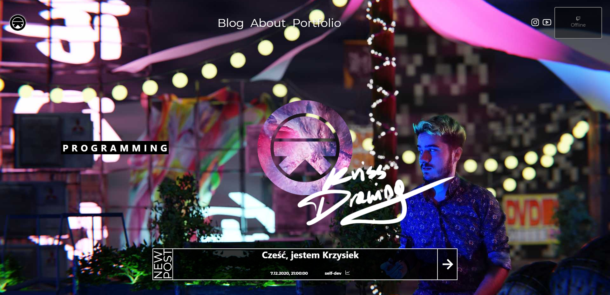
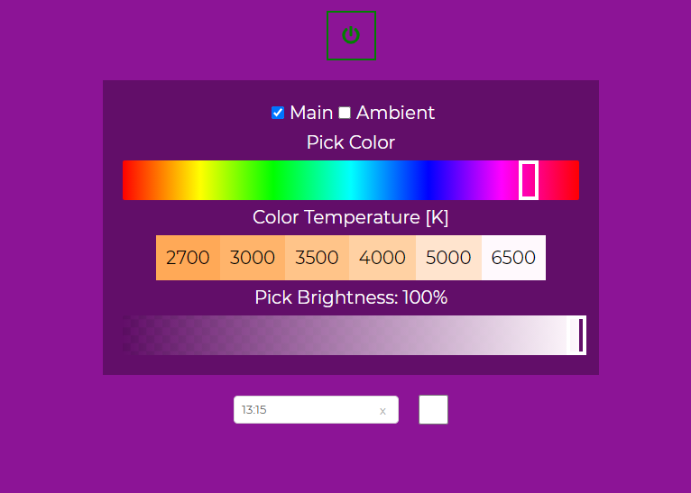
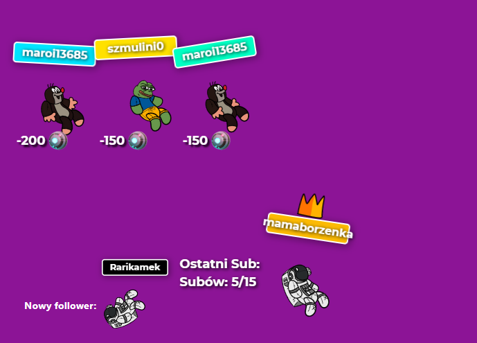

# KrissDrawing website + twitch stream overlay

> Personal webpage, with blog, and portfolio. Additionally frontend for overlay to [my twitch stream](https://www.twitch.tv/krissdrawing) ([github for server side](https://github.com/KrissDrawing/KrissDrawing-twitch-server))

## Table of contents

- [General info](#general-info)
- [Screenshots](#screenshots)
- [Technologies](#technologies)
- [Features](#features)
- [Light controlls UI](#light-controlls-ui)
- [Twitch overlay](#twitch-overlay)
- [Server side](#server-side)
- [Contact](#contact)

## General info

Page made in Gatsby for representative and training purposes. Blog data is updated via headless CMS (DatoCMS). All is animated using gsap library. It contains UI to controlls lighting in my room (light color, intensity, color temp, and light scenes) and overlay for my twitch stream with animated characters and reminders.

## Screenshots

## Technologies

- gatsby - version 2.30
- gsap - version 3.5
- @apollo/client - version 3.3
- axios - version 0.21
- styled-components - version 5.2

## Features

- blog with DatoCms
- UI to light controlls
- overlay for twitch stream

## Light controlls UI

## Twitch overlay

## Server side

Server side of this project is [here](https://github.com/KrissDrawing/KrissDrawing-twitch-server)

## Contact

Created by [KrissDrawing](https://krissdrawing.pl/) - feel free to contact me!
